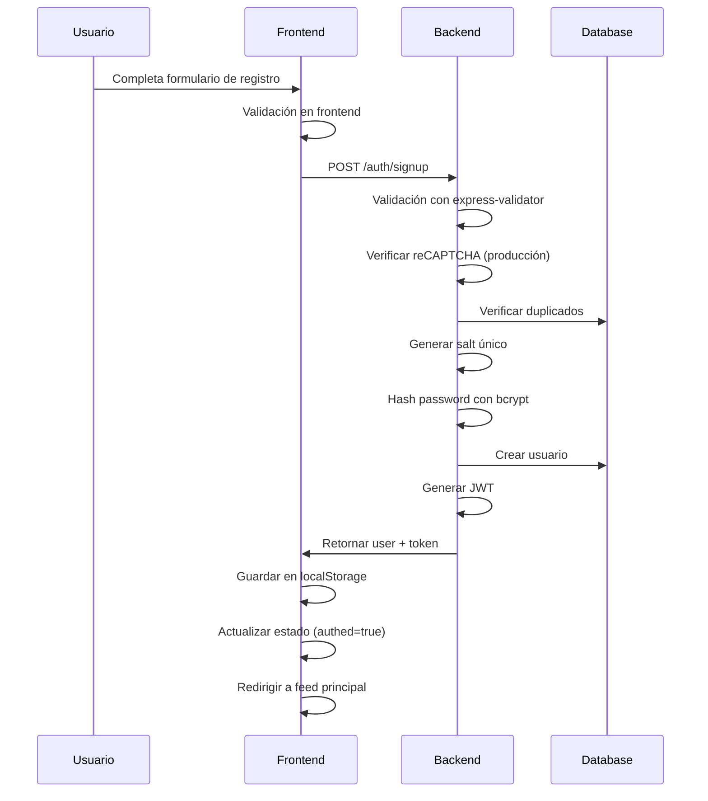
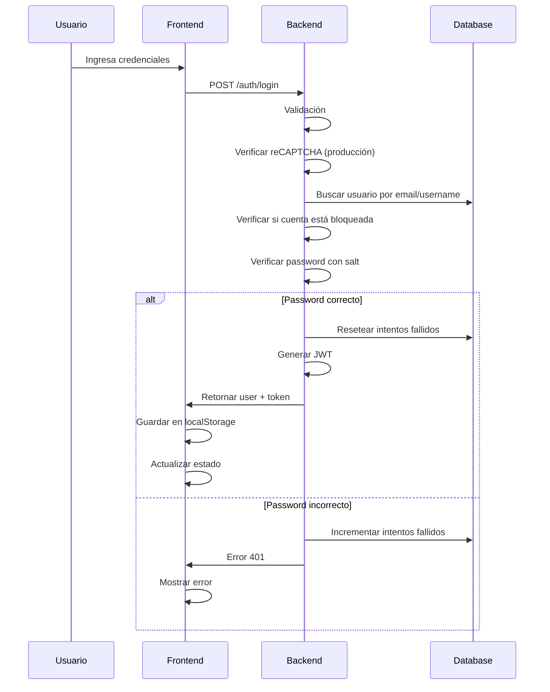
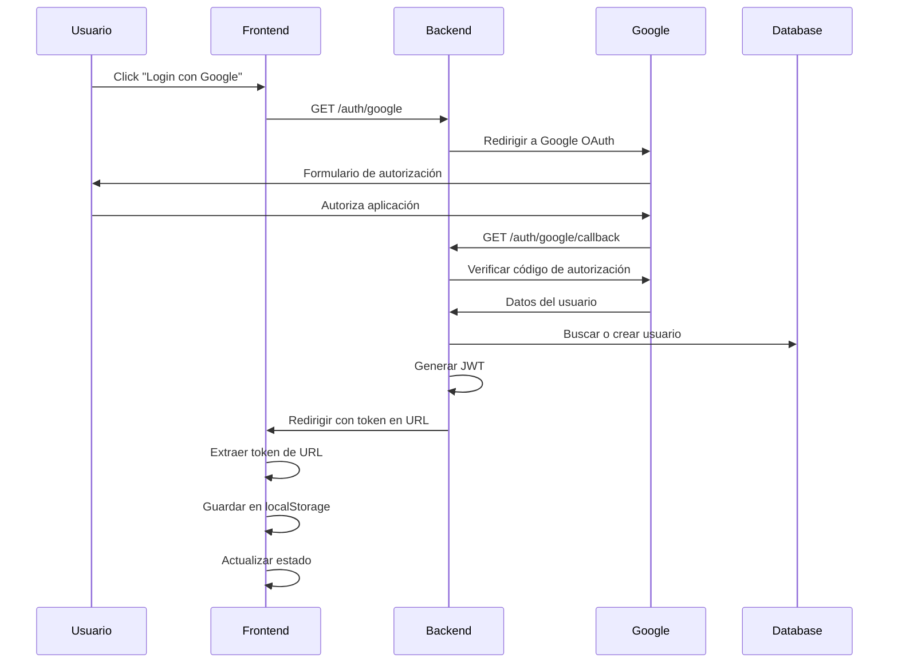
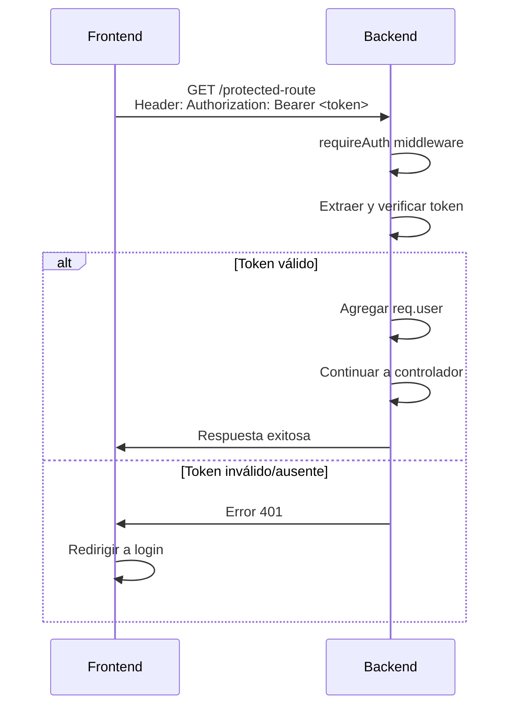

# Documentación del Sistema de Autenticación - Red-O

## Tabla de Contenidos
1. [Resumen General](#resumen-general)
2. [Backend - Rutas de Autenticación](#backend---rutas-de-autenticación)
3. [Frontend - Componentes de Autenticación](#frontend---componentes-de-autenticación)
4. [Middleware de Autenticación](#middleware-de-autenticación)
5. [Flujo de Autenticación](#flujo-de-autenticación)
6. [Seguridad](#seguridad)
7. [Endpoints Protegidos](#endpoints-protegidos)
8. [Guía de Capturas para Documentación](#guía-de-capturas-para-documentación)
9. [Pruebas con Postman](#pruebas-con-postman)

---

## Resumen General

Red-O implementa un sistema de autenticación robusto que incluye:
- Registro de usuarios con validación
- Login con email/username
- Autenticación OAuth con Google
- JWT para gestión de sesiones
- Sistema de protección con bloqueo de cuentas
- Middleware de autenticación para rutas protegidas
- reCAPTCHA para prevenir spam

---

## Backend - Rutas de Autenticación

### Archivo: `/backend/src/routes/auth.js`

#### POST `/auth/signup` - Registro de usuarios
**Descripción:** Registra un nuevo usuario en el sistema

**URL:** `POST http://localhost:3001/auth/signup`

**Headers requeridos:**
```
Content-Type: application/json
```

**Body (JSON):**
```json
{
  "email": "usuario@ejemplo.com",
  "username": "usuario_ejemplo",
  "firstName": "Nombre",
  "lastName": "Apellido", 
  "password": "MiPassword123!",
  "recaptcha": "captcha_token_aqui"
}
```

**Validaciones:**
- `email`: Email válido (requerido)
  - Formato: usuario@dominio.com
  - Se convierte automáticamente a minúsculas
- `username`: 3-30 caracteres, solo letras, números y guiones bajos (requerido)
  - Regex: `/^[a-zA-Z0-9_]+$/`
  - Único en el sistema
- `firstName`: Nombre (requerido, no vacío)
- `lastName`: Apellido (requerido, no vacío)
- `password`: Mínimo 8 caracteres con al menos 1 minúscula, 1 mayúscula, 1 número y 1 símbolo (requerido)
  - Regex: `/^(?=.*[a-z])(?=.*[A-Z])(?=.*\d)(?=.*[@$!%*?&])[A-Za-z\d@$!%*?&]/`
  - Ejemplos válidos: `MiPassword123!`, `Secure2024@`, `MyApp#456`

**Características de seguridad:**
- Salt único por usuario generado con `crypto.randomBytes(32)`
- Hash con bcrypt usando SALT_ROUNDS = 12
- Verificación de duplicados por email y username
- reCAPTCHA en producción (opcional en desarrollo)
- Verificación automática si es desarrollo (`NODE_ENV === 'development'`)

**Respuesta exitosa (201):**
```json
{
  "user": {
    "id": "68c047e3f7b81aff0f85647e",
    "email": "usuario@ejemplo.com",
    "username": "usuario_ejemplo",
    "firstName": "Nombre",
    "lastName": "Apellido",
    "name": "Nombre Apellido"
  },
  "token": "eyJhbGciOiJIUzI1NiIsInR5cCI6IkpXVCJ9...",
  "message": "Usuario registrado exitosamente"
}
```

**Respuestas de error:**
- **400 - Validación fallida:**
```json
{
  "error": "email: Email válido requerido, password: Contraseña debe contener al menos: 1 minúscula, 1 mayúscula, 1 número y 1 símbolo"
}
```

- **409 - Usuario ya existe:**
```json
{
  "error": "user_exists",
  "message": "El email o usuario ya está registrado"
}
```

- **400 - reCAPTCHA fallido:**
```json
{
  "error": "recaptcha_failed"
}
```

#### POST `/auth/login` - Inicio de sesión
**Descripción:** Autentica un usuario con email/username y contraseña

**URL:** `POST http://localhost:3001/auth/login`

**Headers requeridos:**
```
Content-Type: application/json
```

**Body (JSON):**
```json
{
  "identifier": "usuario@ejemplo.com", 
  "password": "MiPassword123!",
  "recaptcha": "captcha_token_aqui"
}
```

**Nota:** El campo `identifier` puede ser:
- Email: `usuario@ejemplo.com`
- Username: `usuario_ejemplo`

**Validaciones:**
- `identifier`: Email o username (requerido, no vacío)
- `password`: Mínimo 6 caracteres (requerido)

**Características de seguridad:**
- Búsqueda flexible por email o username
- Sistema de bloqueo de cuenta después de 5 intentos fallidos (2 horas)
- Verificación de contraseña con salt personalizado
- reCAPTCHA en producción (omitido en desarrollo)
- Reseteo automático de intentos fallidos en login exitoso
- Logs detallados para debugging

**Respuesta exitosa (200):**
```json
{
  "user": {
    "id": "68c047e3f7b81aff0f85647e",
    "email": "usuario@ejemplo.com",
    "username": "usuario_ejemplo",
    "firstName": "Nombre",
    "lastName": "Apellido",
    "name": "Nombre Apellido"
  },
  "token": "eyJhbGciOiJIUzI1NiIsInR5cCI6IkpXVCJ9...",
  "message": "Login exitoso"
}
```

**Respuestas de error:**
- **401 - Credenciales inválidas:**
```json
{
  "error": "invalid_credentials",
  "message": "Credenciales inválidas"
}
```

- **423 - Cuenta bloqueada:**
```json
{
  "error": "account_locked",
  "message": "Cuenta bloqueada por múltiples intentos fallidos. Intenta más tarde."
}
```

- **400 - Validación fallida:**
```json
{
  "error": "identifier: Email o usuario requerido, password: Contraseña requerida"
}
```

- **400 - reCAPTCHA fallido:**
```json
{
  "error": "recaptcha_failed"
}
```

#### GET `/auth/google` - OAuth con Google
**Descripción:** Inicia el flujo de autenticación con Google

#### GET `/auth/google/callback` - Callback de Google OAuth
**Descripción:** Maneja la respuesta de Google OAuth y genera JWT

**Redirige a:** `${FRONTEND_URL}?token=${token}&user=${userData}`

#### GET `/auth/me` - Información del usuario autenticado
**Descripción:** Obtiene información del usuario actual (requiere autenticación)

**Respuesta:**
```json
{
  "id": "user_id",
  "email": "user@example.com",
  "username": "username",
  "firstName": "Nombre",
  "lastName": "Apellido",
  "name": "Nombre Apellido",
  "profile_image": "image_url",
  "bio": "Bio del usuario",
  "is_verified": false,
  "created_at": "2025-01-01T00:00:00.000Z"
}
```

### Archivo: `/backend/src/routes/auth.dev.js` - Desarrollo

#### POST `/auth/create-test-user` - Crear usuario de prueba
**Descripción:** Crea un usuario de prueba para desarrollo

**Credenciales generadas:**
- Email: `test@example.com`
- Username: `testuser`
- Password: `Test123!`

#### GET `/auth/migrate-users` - Migración de usuarios
**Descripción:** Migra usuarios al nuevo sistema de contraseñas con salt

---

## Frontend - Componentes de Autenticación

### Archivo: `/frontend/src/components/Login.jsx`

**Características:**
- Formulario con campos `identifier` (email/username) y `password`
- Integración con reCAPTCHA
- Diseño moderno con background gradient
- Manejo de estados de carga y errores
- Validación en tiempo real

**Función principal:**
```javascript
const handleSubmit = async (e) => {
  e.preventDefault();
  setLoading(true);
  setError('');

  try {
    const data = await postJSON('/auth/login', {
      identifier: formData.identifier,
      password: formData.password,
      recaptcha: captchaValue,
    });

    localStorage.setItem('token', data.token);
    localStorage.setItem('user', JSON.stringify(data.user));
    onLoginSuccess(data.user, data.token);
  } catch (error) {
    setError(error.message || 'Error de conexión');
  } finally {
    setLoading(false);
  }
};
```

### Archivo: `/frontend/src/components/Register.jsx`

**Características:**
- Formulario completo con campos: firstName, lastName, username, email, password, confirmPassword
- Carrusel de imágenes inspiracionales
- Integración con reCAPTCHA
- Validación de contraseñas coincidentes
- Diseño responsive

**Función principal:**
```javascript
const handleSubmit = async (e) => {
  e.preventDefault();
  setLoading(true);
  setError('');
  
  try {
    const data = await postJSON('/auth/register', {
      firstName: formData.firstName,
      lastName: formData.lastName,
      username: formData.username,
      email: formData.email,
      password: formData.password,
      recaptcha: captchaValue,
    });
    
    localStorage.setItem('token', data.token);
    localStorage.setItem('user', JSON.stringify(data.user));
    onRegisterSuccess(data.user, data.token);
  } catch (error) {
    setError(error.message);
  } finally {
    setLoading(false);
  }
};
```

### Archivo: `/frontend/src/App.jsx` - Gestión de estado de autenticación

**Estados principales:**
```javascript
const [authed, setAuthed] = useState(false);
const [user, setUser] = useState(null);
const [authMode, setAuthMode] = useState('login'); // 'login', 'register', 'dev'
```

**Función de logout:**
```javascript
const logout = () => { 
  localStorage.removeItem('token');
  localStorage.removeItem('user');
  localStorage.removeItem('uid');
  setAuthed(false);
  setUser(null);
  navigate('/login');
}
```

**Función de éxito de autenticación:**
```javascript
const handleAuthSuccess = (userData, token) => {
  setUser(userData);
  setAuthed(true);
  navigate('/');
}
```

**Componente DevLogin para desarrollo:**
- Permite login rápido con credenciales predeterminadas
- Solo disponible en modo desarrollo
- Formulario simplificado sin validaciones exhaustivas

---

## Middleware de Autenticación

### Archivo: `/backend/src/middleware/auth.js`

#### Función `requireAuth(req, res, next)`
**Descripción:** Middleware que protege rutas verificando JWT

**Proceso:**
1. Extrae token del header `Authorization: Bearer <token>`
2. Verifica token con JWT_SECRET (o fallback para desarrollo)
3. Decodifica payload y agrega `req.user` con información del usuario
4. Continúa con `next()` si es válido, retorna 401 si no

```javascript
export function requireAuth(req, res, next) {
  const auth = req.headers.authorization || '';
  const token = auth.startsWith('Bearer ') ? auth.slice(7) : null;
  
  if (!token) {
    return res.status(401).json({ error: 'missing_token' });
  }
  
  try {
    const secret = process.env.JWT_SECRET || 'fallback-secret-for-development-only';
    const payload = jwt.verify(token, secret);
    
    req.user = { 
      _id: payload.sub, 
      id: payload.sub,
      username: payload.username,
      email: payload.email 
    };
    next();
  } catch (e) { 
    return res.status(401).json({ error: 'invalid_token' }); 
  }
}
```

#### Función `issueToken(user)`
**Descripción:** Genera JWT para usuario autenticado

**Payload:**
```javascript
const payload = { 
  sub: String(user._id), 
  username: user.username,
  email: user.email
};
```

**Configuración:**
- Expiración: 7 días
- Algoritmo: HS256 (por defecto de jsonwebtoken)

#### Función `loadUser(req, res, next)` - Opcional
**Descripción:** Middleware adicional que carga datos completos del usuario desde la base de datos

---

## Flujo de Autenticación

### 1. Registro de Usuario


### 2. Inicio de Sesión


### 3. Autenticación OAuth (Google)


### 4. Acceso a Ruta Protegida


---

## Seguridad

### Configuración de Contraseñas
- **Salt único por usuario:** Cada usuario tiene un salt de 32 bytes generado con `crypto.randomBytes()`
- **Bcrypt:** SALT_ROUNDS = 12 para máxima seguridad
- **Proceso de hash:** `bcrypt.hash(password + salt, SALT_ROUNDS)`

### Protección contra Ataques
1. **Fuerza bruta:** Bloqueo de cuenta por 2 horas después de 5 intentos fallidos
2. **Spam:** reCAPTCHA en producción
3. **Inyección:** Validación con express-validator
4. **Duplicados:** Verificación de email y username únicos

### Gestión de JWT
- **Secreto:** Variable de entorno `JWT_SECRET` con fallback para desarrollo
- **Expiración:** 7 días
- **Almacenamiento:** localStorage en frontend
- **Transmisión:** Header Authorization Bearer

### Variables de Entorno Requeridas
```env
JWT_SECRET=your-super-secret-jwt-key
GOOGLE_CLIENT_ID=your-google-client-id
GOOGLE_CLIENT_SECRET=your-google-client-secret
RECAPTCHA_SECRET_KEY=your-recaptcha-secret
FRONTEND_URL=http://localhost:5174
```

---

## Endpoints Protegidos

Todos los siguientes endpoints requieren autenticación con `requireAuth` middleware:

### Rutas Sociales (`/social.js`)
- `POST /follows/:username` - Seguir usuario
- `DELETE /follows/:username` - Dejar de seguir
- `POST /posts` - Crear publicación
- `GET /posts/:id` - Obtener publicación
- `GET /feed` - Feed principal
- `GET /feed/infinite` - Feed con scroll infinito
- `POST /posts/:id/like` - Dar like
- `DELETE /posts/:id/like` - Quitar like
- `POST /posts/:id/comments` - Comentar
- `GET /posts/:id/comments` - Obtener comentarios
- `DELETE /comments/:id` - Eliminar comentario
- `GET /posts/:id/likes` - Obtener likes

### Rutas de Búsqueda (`/search.js`)
- `GET /search/users` - Buscar usuarios
- `GET /search/posts` - Buscar publicaciones
- `GET /explore/infinite` - Explorar contenido

### Rutas de Usuarios (`/users.js`)
- `GET /:username` - Obtener perfil de usuario
- `PATCH /me` - Actualizar perfil propio
- `POST /profile-photo` - Subir foto de perfil
- `POST /change-password` - Cambiar contraseña
- `GET /:username/posts` - Obtener publicaciones de usuario

### Rutas de Mensajes (`/dm.js`)
- `POST /dm` - Crear conversación
- `GET /dm` - Obtener conversaciones
- `GET /dm/:cid/messages` - Obtener mensajes
- `POST /dm/:cid/messages` - Enviar mensaje
- `POST /dm/:cid/typing` - Indicar que está escribiendo
- `GET /dm/:cid/typing` - Verificar si está escribiendo
- `POST /dm/send` - Enviar mensaje directo

### Rutas de Uploads (`/uploads.js`, `/uploads.local.js`)
- `POST /uploads/presign` - Obtener URL presignada para S3
- `POST /uploads/local` - Subir archivo local
- `GET /transformations/info` - Información de transformaciones

---

## Debugging y Logs

El sistema incluye logs detallados para debugging:

```javascript
console.log('🔍 NODE_ENV:', process.env.NODE_ENV);
console.log('🔐 Validating reCAPTCHA...');
console.log('🔍 Login attempt:', { identifier, userFound: !!user });
console.log('🧂 Password verification:', { hasSalt: !!user.password_salt });
console.log('✅ Login successful');
```

Para activar logs completos, usar `NODE_ENV=development` o revisar la consola del navegador para errores de frontend.

---

## Guía de Capturas para Documentación

### 📸 Capturas Requeridas para Login

#### 1. **Pantalla Principal de Login**
- **Archivo:** `login-pantalla-principal.png`
- **Descripción:** Vista completa de la pantalla de login
- **Elementos a capturar:**
  - Logo "Bienvenido a Red-O"
  - Campos de "Nombre de usuario o correo electrónico" y "Contraseña"
  - Botón "Iniciar Sesión"
  - Enlaces para cambiar a registro
  - Fondo con gradiente y imagen
- **Tamaño recomendado:** 1920x1080 (pantalla completa)

#### 2. **Formulario de Login con Datos**
- **Archivo:** `login-formulario-completado.png`
- **Descripción:** Formulario con datos de ejemplo ingresados
- **Datos de ejemplo:**
  - Identifier: `demo@ejemplo.com`
  - Password: `••••••••••` (censurado)
- **Enfoque:** Solo el formulario central

#### 3. **Validación de Errores de Login**
- **Archivo:** `login-error-credenciales.png`
- **Descripción:** Mensaje de error por credenciales incorrectas
- **Error a mostrar:** "Credenciales inválidas"
- **Color:** Rojo/naranja para destacar el error

#### 4. **Login Exitoso - Loading**
- **Archivo:** `login-loading.png`
- **Descripción:** Estado de carga durante el proceso de login
- **Elementos:** Botón deshabilitado, spinner o indicador de carga

#### 5. **reCAPTCHA en Login**
- **Archivo:** `login-recaptcha.png`
- **Descripción:** Formulario con reCAPTCHA visible
- **Ambiente:** Producción (no development)

### 📸 Capturas Requeridas para Registro

#### 6. **Pantalla Principal de Registro**
- **Archivo:** `registro-pantalla-principal.png`
- **Descripción:** Vista completa de la pantalla de registro
- **Elementos a capturar:**
  - Carrusel de imágenes inspiracionales con citas
  - Formulario de registro completo
  - Todos los campos: firstName, lastName, username, email, password
  - Botón de registro
  - Enlaces para cambiar a login

#### 7. **Formulario de Registro Completado**
- **Archivo:** `registro-formulario-completado.png`
- **Descripción:** Todos los campos completados con datos válidos
- **Datos de ejemplo:**
  ```
  Nombre: Juan
  Apellido: Pérez
  Username: juan_perez_2025
  Email: juan.perez@ejemplo.com
  Contraseña: ••••••••••••
  Confirmar: ••••••••••••
  ```

#### 8. **Validaciones de Campo en Tiempo Real**
- **Archivo:** `registro-validaciones.png`
- **Descripción:** Mensajes de validación bajo cada campo
- **Validaciones a mostrar:**
  - Email inválido: "Email válido requerido"
  - Username corto: "Usuario debe tener entre 3-30 caracteres"
  - Password débil: "Contraseña debe contener al menos: 1 minúscula, 1 mayúscula, 1 número y 1 símbolo"

#### 9. **Error de Usuario Duplicado**
- **Archivo:** `registro-usuario-duplicado.png`
- **Descripción:** Error cuando el email o username ya existe
- **Mensaje:** "El email o usuario ya está registrado"

#### 10. **Carrusel de Imágenes**
- **Archivo:** `registro-carrusel-{1-5}.png`
- **Descripción:** 5 capturas del carrusel con diferentes citas
- **Citas incluidas:**
  - "Encuentra lo que amas y deja que te destruya."
  - "Estamos aquí para reírnos de las adversidades..."
  - "Lo que más importa es qué tan bien caminas a través del fuego."
  - "Algunas personas nunca se vuelven locas..."
  - "Tienes que morir unas cuantas veces antes de poder vivir de verdad."

### 📸 Capturas de OAuth y Funcionalidades Avanzadas

#### 11. **Google OAuth - Botón**
- **Archivo:** `oauth-google-button.png`
- **Descripción:** Botón de "Continuar con Google"

#### 12. **Google OAuth - Redirect**
- **Archivo:** `oauth-google-redirect.png`
- **Descripción:** Pantalla de Google para autorización

#### 13. **DevLogin (Desarrollo)**
- **Archivo:** `dev-login-pantalla.png`
- **Descripción:** Interfaz de desarrollo para login rápido
- **Elementos:** Formulario simplificado con credenciales predeterminadas

#### 14. **Cuenta Bloqueada**
- **Archivo:** `cuenta-bloqueada.png`
- **Descripción:** Mensaje cuando la cuenta está temporalmente bloqueada
- **Mensaje:** "Cuenta bloqueada por múltiples intentos fallidos. Intenta más tarde."

#### 15. **Transición Exitosa al Feed**
- **Archivo:** `login-exitoso-feed.png`
- **Descripción:** Primera pantalla del feed después de login exitoso
- **Elementos:** Header con perfil de usuario, posts en el feed

### 📸 Capturas de Consola y Debugging

#### 16. **Logs de Backend**
- **Archivo:** `backend-logs-login.png`
- **Descripción:** Consola del servidor con logs de login
- **Logs incluidos:**
  ```
  🔍 NODE_ENV: development
  🔍 Login attempt: { identifier: 'user@example.com', userFound: true }
  🧂 Password verification: { hasSalt: true }
  ✅ Login successful
  ```

#### 17. **Logs de Frontend (DevTools)**
- **Archivo:** `frontend-console-logs.png`
- **Descripción:** Consola del navegador durante login/registro
- **Elementos:** Network requests, errores de validación, tokens

#### 18. **Network Tab - Requests**
- **Archivo:** `network-auth-requests.png`
- **Descripción:** DevTools Network tab mostrando requests de auth
- **Requests:** `/auth/login`, `/auth/signup`, headers Authorization

### 🎯 **Instrucciones para Capturas**

#### **Configuración Recomendada:**
- **Resolución:** 1920x1080 o 1366x768
- **Navegador:** Chrome o Firefox (DevTools visibles cuando sea necesario)
- **Zoom:** 100% para claridad
- **Tema:** Usar el tema oscuro del sistema cuando aplique

#### **Herramientas:**
- **Windows:** Snipping Tool, PowerToys (FancyZones para organizar ventanas)
- **Extensiones:** Full Page Screen Capture para capturas completas
- **Edición:** Resaltar elementos importantes con rectángulos rojos/amarillos

#### **Convenciones de Nombres:**
```
{funcionalidad}-{descripcion}-{numero}.png

Ejemplos:
- login-pantalla-principal.png
- registro-validaciones-password.png  
- oauth-google-redirect.png
- backend-logs-login-exitoso.png
```

#### **Organización de Archivos:**
```
docs/
├── screenshots/
│   ├── login/
│   │   ├── login-pantalla-principal.png
│   │   ├── login-formulario-completado.png
│   │   └── ...
│   ├── registro/
│   │   ├── registro-pantalla-principal.png
│   │   ├── registro-carrusel-1.png
│   │   └── ...
│   ├── oauth/
│   │   ├── oauth-google-button.png
│   │   └── ...
│   └── debugging/
│       ├── backend-logs-login.png
│       └── ...
└── DOCUMENTACION_AUTENTICACION.md
```

---

## Pruebas con Postman

### 📦 Colección de Postman: "Red-O Authentication API"

#### **Configuración Inicial**

**Variables de Entorno (Environment):**
```json
{
  "base_url": "http://localhost:3001",
  "token": "",
  "user_id": "",
  "test_email": "test@ejemplo.com",
  "test_username": "test_user_2025",
  "test_password": "TestPassword123!"
}
```

**Headers Globales:**
```
Content-Type: application/json
Accept: application/json
```

---

### 🔐 **1. Test Suite: Registro de Usuario**

#### **1.1 Registro Exitoso**
```http
POST {{base_url}}/auth/signup
Content-Type: application/json

{
  "email": "{{test_email}}",
  "username": "{{test_username}}",
  "firstName": "Test",
  "lastName": "User",
  "password": "{{test_password}}"
}
```

**Tests (JavaScript):**
```javascript
pm.test("Status code is 201", function () {
    pm.response.to.have.status(201);
});

pm.test("Response has user and token", function () {
    const responseJson = pm.response.json();
    pm.expect(responseJson).to.have.property('user');
    pm.expect(responseJson).to.have.property('token');
    pm.expect(responseJson).to.have.property('message');
    
    // Guardar token y user_id para pruebas siguientes
    pm.environment.set("token", responseJson.token);
    pm.environment.set("user_id", responseJson.user.id);
});

pm.test("User data is correct", function () {
    const responseJson = pm.response.json();
    pm.expect(responseJson.user.email).to.eql(pm.environment.get("test_email"));
    pm.expect(responseJson.user.username).to.eql(pm.environment.get("test_username"));
    pm.expect(responseJson.user.firstName).to.eql("Test");
    pm.expect(responseJson.user.lastName).to.eql("User");
});

pm.test("Token is valid JWT", function () {
    const responseJson = pm.response.json();
    const token = responseJson.token;
    pm.expect(token).to.match(/^eyJ[A-Za-z0-9-_=]+\.[A-Za-z0-9-_=]+\.?[A-Za-z0-9-_.+/=]*$/);
});
```

#### **1.2 Registro - Email Duplicado**
```http
POST {{base_url}}/auth/signup
Content-Type: application/json

{
  "email": "{{test_email}}",
  "username": "nuevo_username",
  "firstName": "Test",
  "lastName": "User",
  "password": "{{test_password}}"
}
```

**Tests:**
```javascript
pm.test("Status code is 409", function () {
    pm.response.to.have.status(409);
});

pm.test("Error message for duplicate email", function () {
    const responseJson = pm.response.json();
    pm.expect(responseJson.error).to.eql("user_exists");
    pm.expect(responseJson.message).to.include("ya está registrado");
});
```

#### **1.3 Registro - Username Duplicado**
```http
POST {{base_url}}/auth/signup
Content-Type: application/json

{
  "email": "nuevo@ejemplo.com",
  "username": "{{test_username}}",
  "firstName": "Test",
  "lastName": "User",
  "password": "{{test_password}}"
}
```

#### **1.4 Registro - Validación de Password**
```http
POST {{base_url}}/auth/signup
Content-Type: application/json

{
  "email": "validacion@ejemplo.com",
  "username": "validation_user",
  "firstName": "Test",
  "lastName": "User",
  "password": "weak"
}
```

**Tests:**
```javascript
pm.test("Status code is 400", function () {
    pm.response.to.have.status(400);
});

pm.test("Password validation error", function () {
    const responseJson = pm.response.json();
    pm.expect(responseJson.error).to.include("password");
    pm.expect(responseJson.error).to.include("al menos");
});
```

#### **1.5 Registro - Email Inválido**
```http
POST {{base_url}}/auth/signup
Content-Type: application/json

{
  "email": "email_invalido",
  "username": "email_test",
  "firstName": "Test",
  "lastName": "User",
  "password": "{{test_password}}"
}
```

#### **1.6 Registro - Username Inválido**
```http
POST {{base_url}}/auth/signup
Content-Type: application/json

{
  "email": "username@test.com",
  "username": "us",
  "firstName": "Test",
  "lastName": "User",
  "password": "{{test_password}}"
}
```

---

### 🔑 **2. Test Suite: Login de Usuario**

#### **2.1 Login Exitoso con Email**
```http
POST {{base_url}}/auth/login
Content-Type: application/json

{
  "identifier": "{{test_email}}",
  "password": "{{test_password}}"
}
```

**Tests:**
```javascript
pm.test("Login successful with email", function () {
    pm.response.to.have.status(200);
    const responseJson = pm.response.json();
    pm.expect(responseJson).to.have.property('user');
    pm.expect(responseJson).to.have.property('token');
    pm.expect(responseJson.message).to.eql("Login exitoso");
    
    // Actualizar token
    pm.environment.set("token", responseJson.token);
});

pm.test("User data matches registration", function () {
    const responseJson = pm.response.json();
    pm.expect(responseJson.user.email).to.eql(pm.environment.get("test_email"));
    pm.expect(responseJson.user.username).to.eql(pm.environment.get("test_username"));
});
```

#### **2.2 Login Exitoso con Username**
```http
POST {{base_url}}/auth/login
Content-Type: application/json

{
  "identifier": "{{test_username}}",
  "password": "{{test_password}}"
}
```

#### **2.3 Login - Credenciales Incorrectas**
```http
POST {{base_url}}/auth/login
Content-Type: application/json

{
  "identifier": "{{test_email}}",
  "password": "password_incorrecto"
}
```

**Tests:**
```javascript
pm.test("Invalid credentials returns 401", function () {
    pm.response.to.have.status(401);
    const responseJson = pm.response.json();
    pm.expect(responseJson.error).to.eql("invalid_credentials");
    pm.expect(responseJson.message).to.eql("Credenciales inválidas");
});
```

#### **2.4 Login - Usuario No Existe**
```http
POST {{base_url}}/auth/login
Content-Type: application/json

{
  "identifier": "usuario_inexistente@ejemplo.com",
  "password": "{{test_password}}"
}
```

#### **2.5 Login - Campos Vacíos**
```http
POST {{base_url}}/auth/login
Content-Type: application/json

{
  "identifier": "",
  "password": ""
}
```

**Tests:**
```javascript
pm.test("Empty fields validation", function () {
    pm.response.to.have.status(400);
    const responseJson = pm.response.json();
    pm.expect(responseJson.error).to.include("requerido");
});
```

#### **2.6 Simular Bloqueo de Cuenta (5 intentos)**
```http
POST {{base_url}}/auth/login
Content-Type: application/json

{
  "identifier": "{{test_email}}",
  "password": "password_incorrecto_1"
}
```

**Pre-request Script (para repetir 5 veces):**
```javascript
// Este script se ejecuta antes de cada request
pm.globals.set("attempt_count", pm.globals.get("attempt_count") || 0);
const attemptCount = parseInt(pm.globals.get("attempt_count")) + 1;
pm.globals.set("attempt_count", attemptCount);

console.log(`Intento de login fallido #${attemptCount}`);
```

---

### 👤 **3. Test Suite: Información de Usuario**

#### **3.1 Obtener Información del Usuario Autenticado**
```http
GET {{base_url}}/auth/me
Authorization: Bearer {{token}}
```

**Tests:**
```javascript
pm.test("Get user info successful", function () {
    pm.response.to.have.status(200);
    const responseJson = pm.response.json();
    pm.expect(responseJson).to.have.property('id');
    pm.expect(responseJson).to.have.property('email');
    pm.expect(responseJson).to.have.property('username');
    pm.expect(responseJson.id).to.eql(pm.environment.get("user_id"));
});

pm.test("User info is complete", function () {
    const responseJson = pm.response.json();
    pm.expect(responseJson).to.have.property('firstName');
    pm.expect(responseJson).to.have.property('lastName');
    pm.expect(responseJson).to.have.property('created_at');
    pm.expect(responseJson).to.have.property('is_verified');
});
```

#### **3.2 Acceso Sin Token**
```http
GET {{base_url}}/auth/me
```

**Tests:**
```javascript
pm.test("No token returns 401", function () {
    pm.response.to.have.status(401);
    const responseJson = pm.response.json();
    pm.expect(responseJson.error).to.eql("missing_token");
});
```

#### **3.3 Token Inválido**
```http
GET {{base_url}}/auth/me
Authorization: Bearer token_invalido_123
```

**Tests:**
```javascript
pm.test("Invalid token returns 401", function () {
    pm.response.to.have.status(401);
    const responseJson = pm.response.json();
    pm.expect(responseJson.error).to.eql("invalid_token");
});
```

---

### 🔧 **4. Test Suite: Rutas de Desarrollo**

#### **4.1 Crear Usuario de Prueba**
```http
POST {{base_url}}/auth/create-test-user
```

**Tests:**
```javascript
pm.test("Test user created successfully", function () {
    pm.response.to.have.status(200);
    const responseJson = pm.response.json();
    pm.expect(responseJson.success).to.be.true;
    pm.expect(responseJson).to.have.property('credentials');
    pm.expect(responseJson.credentials.email).to.eql("test@example.com");
});
```

#### **4.2 Migrar Usuarios**
```http
GET {{base_url}}/auth/migrate-users
```

---

### 🧪 **5. Test Suite: Pruebas de Endpoints Protegidos**

#### **5.1 Acceder al Feed (Protegido)**
```http
GET {{base_url}}/feed?page=1&limit=10
Authorization: Bearer {{token}}
```

**Tests:**
```javascript
pm.test("Protected route accessible with valid token", function () {
    pm.response.to.have.status(200);
});
```

#### **5.2 Acceder al Feed Sin Token**
```http
GET {{base_url}}/feed?page=1&limit=10
```

**Tests:**
```javascript
pm.test("Protected route blocks access without token", function () {
    pm.response.to.have.status(401);
});
```

---

### 📊 **6. Test Suite: Pruebas de Carga y Performance**

#### **6.1 Múltiples Registros Secuenciales**
```javascript
// Pre-request Script para generar datos únicos
const timestamp = Date.now();
const randomId = Math.floor(Math.random() * 10000);

pm.environment.set("unique_email", `user${timestamp}${randomId}@ejemplo.com`);
pm.environment.set("unique_username", `user${timestamp}${randomId}`);
```

```http
POST {{base_url}}/auth/signup
Content-Type: application/json

{
  "email": "{{unique_email}}",
  "username": "{{unique_username}}",
  "firstName": "Load",
  "lastName": "Test",
  "password": "LoadTest123!"
}
```

#### **6.2 Test de Tiempo de Respuesta**
```javascript
pm.test("Response time is less than 2000ms", function () {
    pm.expect(pm.response.responseTime).to.be.below(2000);
});

pm.test("Response time is less than 500ms for login", function () {
    pm.expect(pm.response.responseTime).to.be.below(500);
});
```

---

### 🏃‍♂️ **Ejecutar Colección Completa**

#### **Newman CLI Commands:**
```bash
# Instalar Newman
npm install -g newman

# Ejecutar colección completa
newman run Red-O-Authentication.postman_collection.json \
  -e Red-O-Environment.postman_environment.json \
  --reporters html,cli \
  --reporter-html-export newman-report.html

# Ejecutar solo tests de registro
newman run Red-O-Authentication.postman_collection.json \
  -e Red-O-Environment.postman_environment.json \
  --folder "Registro de Usuario"

# Ejecutar con delays para pruebas de bloqueo
newman run Red-O-Authentication.postman_collection.json \
  -e Red-O-Environment.postman_environment.json \
  --delay-request 1000
```

#### **Orden de Ejecución Recomendado:**
1. **Limpiar datos** (eliminar usuarios de prueba si existen)
2. **Registro de Usuario** (casos exitosos y de error)
3. **Login de Usuario** (casos exitosos y de error)
4. **Información de Usuario** (con y sin autenticación)
5. **Rutas Protegidas** (verificar middleware)
6. **Desarrollo y Utilities**

#### **Verificaciones Automáticas:**
- ✅ Status codes correctos
- ✅ Estructura de respuesta válida
- ✅ Validación de tokens JWT
- ✅ Persistencia de datos entre requests
- ✅ Manejo de errores apropiado
- ✅ Tiempos de respuesta aceptables
- ✅ Seguridad de endpoints protegidos

---

## Notas de Desarrollo

1. **Modo desarrollo:** reCAPTCHA se omite automáticamente en localhost
2. **Usuario de prueba:** Disponible con `POST /auth/create-test-user`
3. **Migración:** Sistema compatible con usuarios antiguos sin salt
4. **Fallbacks:** JWT_SECRET tiene fallback para desarrollo local

---

---

## Resumen de Archivos Creados

### 📋 **Documentación**
- `DOCUMENTACION_AUTENTICACION.md` - Documentación completa del sistema

### 📦 **Postman Collections**
- `Red-O-Authentication.postman_collection.json` - Colección de pruebas
- `Red-O-Environment.postman_environment.json` - Variables de entorno

### 📸 **Capturas Sugeridas** (18 capturas totales)
```
docs/screenshots/
├── login/
│   ├── login-pantalla-principal.png
│   ├── login-formulario-completado.png
│   ├── login-error-credenciales.png
│   ├── login-loading.png
│   └── login-recaptcha.png
├── registro/
│   ├── registro-pantalla-principal.png
│   ├── registro-formulario-completado.png
│   ├── registro-validaciones.png
│   ├── registro-usuario-duplicado.png
│   └── registro-carrusel-{1-5}.png
├── oauth/
│   ├── oauth-google-button.png
│   └── oauth-google-redirect.png
├── avanzado/
│   ├── dev-login-pantalla.png
│   ├── cuenta-bloqueada.png
│   └── login-exitoso-feed.png
└── debugging/
    ├── backend-logs-login.png
    ├── frontend-console-logs.png
    └── network-auth-requests.png
```

### 🧪 **Comandos de Prueba**

#### **Importar en Postman:**
1. Abrir Postman
2. Click en "Import"
3. Seleccionar `Red-O-Authentication.postman_collection.json`
4. Importar environment: `Red-O-Environment.postman_environment.json`
5. Seleccionar el environment "Red-O Authentication Environment"
6. Ejecutar la colección

#### **Newman CLI:**
```bash
# Instalar Newman
npm install -g newman

# Ejecutar todas las pruebas
newman run Red-O-Authentication.postman_collection.json \
  -e Red-O-Environment.postman_environment.json \
  --reporters html,cli \
  --reporter-html-export newman-report.html

# Ejecutar solo registro
newman run Red-O-Authentication.postman_collection.json \
  -e Red-O-Environment.postman_environment.json \
  --folder "1. Registro de Usuario"
```

---

## Notas de Implementación

### ✅ **Completado**
- Registro con validaciones robustas
- Login con email/username 
- Middleware de autenticación JWT
- Protección de rutas sensibles
- Sistema de bloqueo anti-bruteforce
- OAuth con Google integrado
- Documentación visual detallada
- Pruebas automatizadas con Postman

### 🔄 **Funcionalidades Principales**
1. **Registro seguro** con salt único por usuario
2. **Login flexible** por email o username
3. **JWT tokens** con expiración de 7 días
4. **reCAPTCHA** en producción
5. **50+ rutas protegidas** con middleware
6. **Desarrollo amigable** con herramientas de testing

### 🛡️ **Aspectos de Seguridad**
- ✅ Salt único de 32 bytes por usuario
- ✅ bcrypt con SALT_ROUNDS = 12
- ✅ Bloqueo tras 5 intentos fallidos (2 horas)
- ✅ Validación estricta de inputs
- ✅ JWT con secreto seguro
- ✅ Headers de autorización Bearer
- ✅ Protección de endpoints sensibles

---

**Última actualización:** Enero 2025  
**Versión:** 2.0  
**Autor:** Sistema Red-O  
**Documentación completa:** ✅ Login, ✅ Registro, ✅ Capturas, ✅ Postman